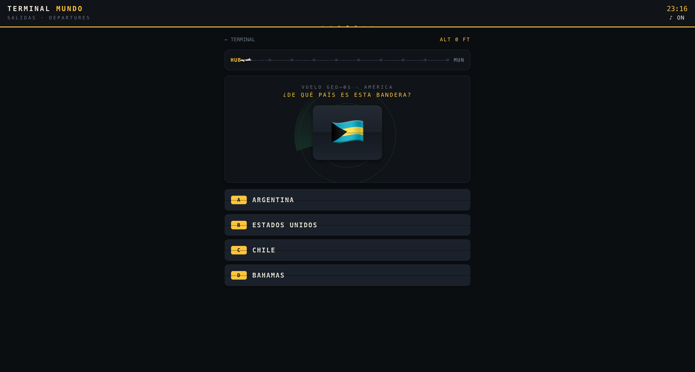
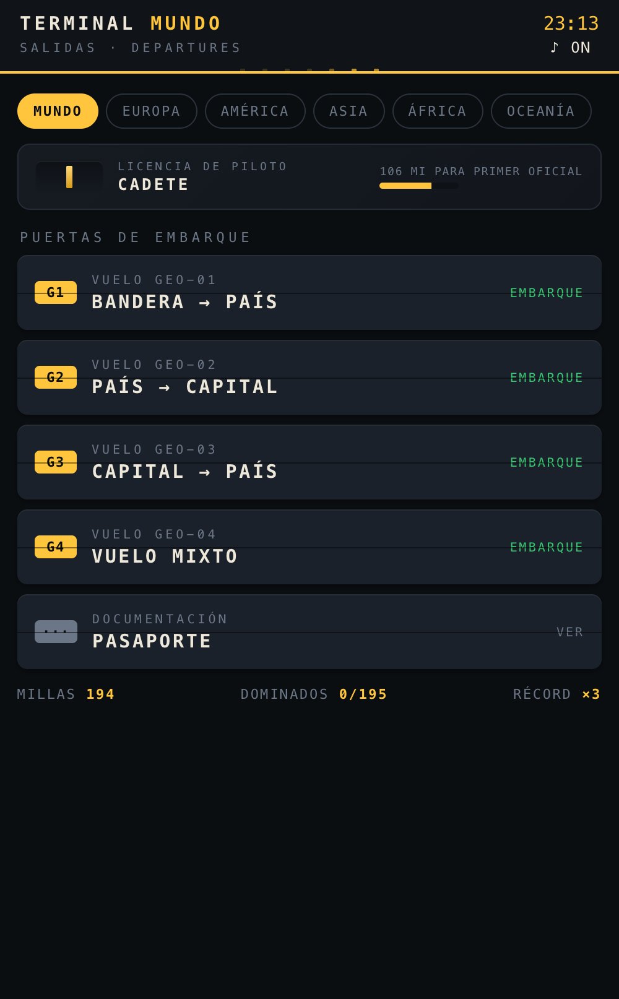
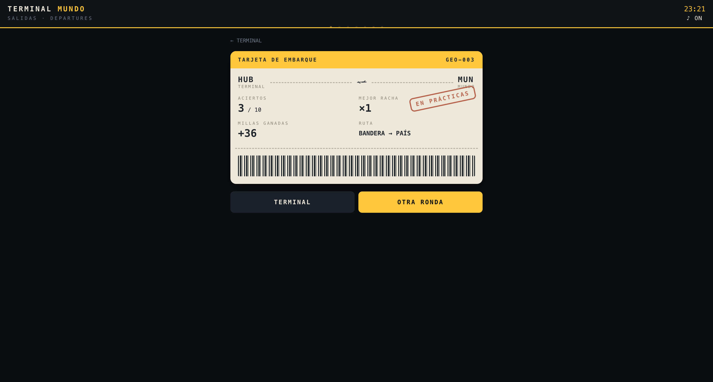
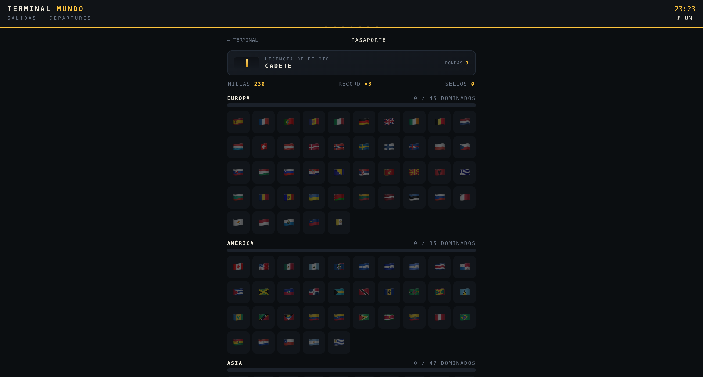

# 🌍 TERMINAL MUNDO

**Aprende países, capitales y banderas embarcando en vuelos de un panel split-flap.**

---

## 🛫 Qué es esto

**Terminal Mundo** es un juego de memoria geográfica ambientado en un panel de
salidas de aeropuerto de los de antes (split-flap Solari): cada ronda es un
**vuelo** de 10 preguntas que despega de tu HUB, hace escala en cada acierto
(verde) o turbulencia (rojo), y aterriza en una **tarjeta de embarque** con tu
sello — PERFECTO, APTO o EN PRÁCTICAS.

Las letras giran con su *clac-clac* sintetizado en Web Audio, la bandera aparece
sobre un radar de aproximación, y tu racha se mide en **altitud**: cada acierto
sube 1.000 ft, un fallo te devuelve a pista.

## ✈️ Qué tiene dentro

- 🌍 **195 países** con nombre y capital en castellano, agrupados en 5
  continentes filtrables. La bandera es el emoji derivado del código ISO —
  ni una sola imagen en todo el juego.
- 🎫 **4 puertas de embarque**: bandera → país, país → capital, capital → país
  y vuelo mixto.
- 🧠 **Repaso ponderado**: cada país guarda un nivel 0–3 por modo; lo que
  fallas vuelve a salir enseguida y lo dominado casi desaparece. Los
  distractores son siempre de la misma región (te enfrentará los dos Congos,
  no Francia contra Fiyi).
- 🎖️ **Licencia de piloto**: millas, rachas y 5 rangos con galones — de
  CADETE a AS DEL AIRE — con ceremonia de ascenso incluida.
- 🛂 **Pasaporte**: las banderas se iluminan al dominarlas (nivel ≥2 en los
  tres modos) y ganan su sello ✓; tocar cualquiera te chiva país y capital.
- 📴 **PWA completa**: instalable en el móvil, funciona 100 % offline con un
  service worker cache-first (~45 KB en total).

## 📸 Pantallas

| Terminal | Vuelo | Embarque | Pasaporte |
|---|---|---|---|
|  |  |  |  |

## 🔧 Cómo está hecho

- **Un solo `index.html`**: CSS, datos y lógica inline, JavaScript vanilla.
  Sin build, sin frameworks, sin fuentes externas (mono del sistema, como los
  paneles de verdad).
- El **split-flap** es un intervalo por carácter que baraja glifos con retardo
  en ola; el avión, las nubes, la pista y los galones son **SVG/CSS inline**.
- El **audio** se sintetiza al vuelo: osciladores para los blips y ruido
  filtrado para la turbina del despegue.
- El progreso vive en `localStorage` (`tm.state`). Para invalidar la caché al
  desplegar cambios, sube la versión `tm-vN` en `sw.js`.
- `icon.html` es la fuente de los iconos: se captura con Chrome headless y se
  reescala con ImageMagick.

## 📄 Licencia

[MIT](LICENSE) — vuela libre.
